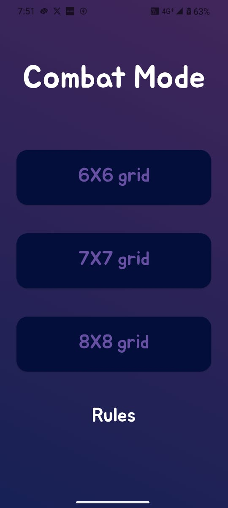
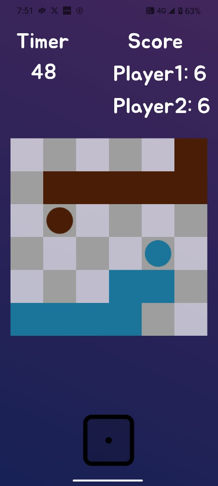

# 🎨 Palette

Palette is a **2D board game** built with [Flutter](https://flutter.dev/), available for both **iOS** and **Android**.  
The game is designed to be simple, fun, and visually engaging.

---

## 📱 Download

- **Android (APK):** [Download here](https://github.com/123thirumal/Palette/releases/download/v1.0.0/app-release.apk)  

---

## 🎮 Features

- Cross-platform: Runs on both iOS and Android
- 2D board game mechanics
- Simple and intuitive UI
- Lightweight and fast

---

## 📸 Screenshots

| Home Screen | Gameplay | Scoreboard |
|-------------|----------|------------|
|  |  |  |

*(Replace the image paths with your actual screenshots — you can keep them in an `assets/screenshots/` folder or link to GitHub-hosted images.)*

---

## 🚀 Getting Started (For Developers)

If you want to run this project locally:

```bash
# Clone the repo
git clone https://github.com/your-username/palette.git
cd palette

# Get dependencies
flutter pub get

# Run on connected device
flutter run
